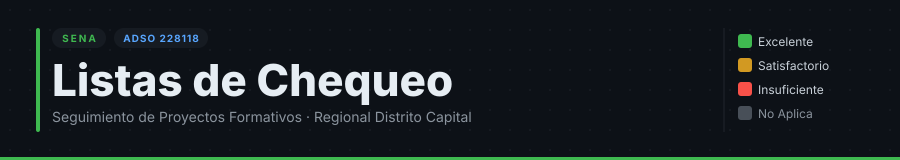
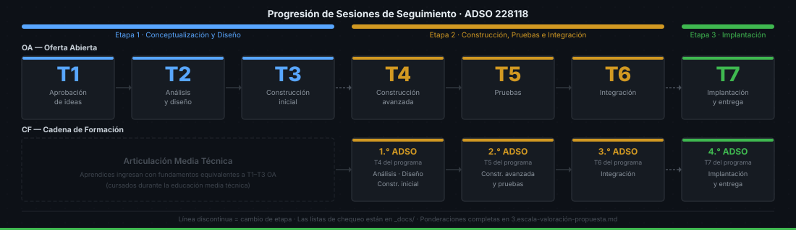

[](LICENSE)
[](CONTRIBUTING.md)
[](CODE_OF_CONDUCT.md)

# Listas de Chequeo — Seguimiento de Proyectos ADSO

Instrumento de evaluación estandarizado para las sesiones de seguimiento de proyectos formativos del programa **Análisis y Desarrollo de Software (ADSO, cód. 228118)** — SENA Regional Distrito Capital, Centro de Gestión de Mercados, Logística y Tecnologías de la Información.

<br>

### 🏃 _"Entrena para un kilómetro. La carrera solo mide cien metros."_

<br>

---

## Tabla de contenidos

- [¿Por qué existe este instrumento?](#por-qué-existe-este-instrumento)
- [Referentes metodológicos](#referentes-metodológicos)
- [Estructura de cada lista](#estructura-de-cada-lista)
- [Escala de valoración](#escala-de-valoración)
- [Ponderación por etapa](#ponderación-por-etapa)
- [Líneas rojas — dominios no aprobables](#líneas-rojas--dominios-no-aprobables)
- [Ventajas y limitaciones del instrumento](#ventajas-y-limitaciones-del-instrumento)
- [Mapa del repositorio](#mapa-del-repositorio)
- [Listas disponibles](#listas-disponibles)
- [Cómo usar una lista](#cómo-usar-una-lista)
- [Ruta de lectura recomendada](#ruta-de-lectura-recomendada)
- [Contribuir](#contribuir)

---

## ¿Por qué existe este instrumento?

Sin un instrumento común, cada instructor evalúa con criterios distintos: inequidad entre grupos, confusión en los aprendices y dificultad para detectar rezagos a tiempo. Ver el problema completo en [0.problema.md](0.problema.md).

---

## Referentes metodológicos

Cada ítem de cada lista está anclado simultáneamente a tres referentes. Ver desarrollo completo en [1.justificación-metodologica.md](1.justificación-metodologica.md).

1. **Programa de Formación ADSO (228118):** competencias y RAP por trimestre.
2. **Proyecto Formativo:** fases del ciclo de vida del software y entregables esperados.
3. **Estándares de la industria:** IEEE, ISO/IEC 25010, CMMI, Scrum/Kanban.

Cada ítem fue diseñado con cuatro criterios de viabilidad: **verificable**, **alcanzable**, **progresivo** y **orientado a evidencia**.

---

## Estructura de cada lista

Cinco dimensiones con distinto peso según el momento formativo. Ver detalle en [2.estructura-de-lista-propuesta.md](2.estructura-de-lista-propuesta.md).

| Dimensión                           | Foco                                                                                        |
| ----------------------------------- | ------------------------------------------------------------------------------------------- |
| **1 · Gestión del Proyecto**        | Backlog, actas, roles, herramientas de seguimiento (Jira, Trello, GitHub Projects, ClickUp) |
| **2 · Artefactos Técnicos**         | Entregables específicos del RAP del trimestre: diagramas, modelos, código, APIs, BD         |
| **3 · Documentación**               | Relevancia, estándares (no "documentación de relleno") y control de versiones               |
| **4 · Trabajo en Equipo y Proceso** | Commits distribuidos, tareas equitativas, participación en la sustentación                  |
| **5 · Calidad y Mejores Prácticas** | Convenciones de código, revisión entre pares, pruebas cuando aplica                         |

---

## Escala de valoración

Ver contexto completo en [3.escala-valoración-propuesta.md](3.escala-valoración-propuesta.md).

| Nivel         | Símbolo | Descripción                                    |
| ------------- | ------- | ---------------------------------------------- |
| Excelente     | ✅      | Cumple completamente y con evidencia sólida    |
| Satisfactorio | 🟡      | Cumple parcialmente o con evidencia incompleta |
| Insuficiente  | 🔴      | No cumple o la evidencia es muy débil          |
| No Aplica     | ➖      | El ítem no corresponde a este equipo/proyecto  |

---

## Ponderación por etapa

| Dimensión                   | T1–T3 | T4–T6 | T7  |
| --------------------------- | ----- | ----- | --- |
| Gestión del Proyecto        | 20%   | 20%   | 15% |
| Artefactos Técnicos         | 40%   | 40%   | 35% |
| Documentación               | 20%   | 15%   | 25% |
| Trabajo en Equipo           | 10%   | 10%   | 10% |
| Calidad y Mejores Prácticas | 10%   | 15%   | 15% |



---

## Líneas rojas — dominios no aprobables

Ciertos dominios están restringidos por razones pedagógicas, legales o de viabilidad, no por capricho. Ver razonamiento completo en [5.lineas-rojas-ideas-de-proyecto.md](5.lineas-rojas-ideas-de-proyecto.md).

| Dominio                             | Razón principal                                                                                    |
| ----------------------------------- | -------------------------------------------------------------------------------------------------- |
| Inventarios                         | Saturado; soluciones industriales gratuitas lo hacen irrelevante como aprendizaje                  |
| Contabilidad                        | Regulaciones técnicas estrictas (PUC, DIAN, NIIF) que el aprendiz no puede cumplir correctamente   |
| Facturación electrónica             | Marco legal DIAN con XML, certificados digitales y validación previa — fuera del alcance formativo |
| Datos sensibles sin mitigación      | Ley 1581 de Habeas Data; riesgo real si se manejan datos de salud o menores sin controles          |
| Hardware no disponible en el CGMLTI | Proyectos inviables por dependencia de dispositivos que el SENA no garantiza                       |

> **Aprobación con condiciones:** hardware de propósito general (Arduino, sensores básicos) es viable si el equipo declara explícitamente que asume costo y operación, dejando constancia en acta.

---

## Ventajas y limitaciones del instrumento

Ver análisis completo en [4.pros-cons.md](4.pros-cons.md).

**Ventajas clave:**

- Reduce el sesgo del evaluador y permite comparar grupos en igualdad de condiciones.
- Trazable directamente al programa oficial → facilita auditorías y visitas de seguimiento.
- La escala de cuatro niveles da retroalimentación accionable: el aprendiz sabe exactamente qué mejorar.
- La evidencia de commits desincentiva el _free rider_.

**Limitaciones a tener en cuenta:**

- Es un instrumento de orientación, no una camisa de fuerza: proyectos IoT, datos o móvil pueden requerir ajustes en artefactos técnicos.
- Asume uso de GitHub; si el grupo usa otra herramienta, el ítem debe adaptarse.
- La calibración entre jurados sigue siendo necesaria: se recomienda una reunión semestral de instructores antes de cada ronda de seguimientos.

---

## Mapa del repositorio

```
checklist-proyectos-adso/
│
├── README.md                              ← estás aquí
├── LICENSE                                ← CC BY-SA 4.0
├── CONTRIBUTING.md                        ← cómo contribuir
├── CODE_OF_CONDUCT.md                     ← Contributor Covenant v2.1
├── SECURITY.md                            ← política de privacidad de datos
│
├── 0.problema.md                          ← por qué existe este instrumento
├── 1.justificación-metodologica.md        ← referentes y criterios de diseño
├── 2.estructura-de-lista-propuesta.md     ← las 5 dimensiones explicadas
├── 3.escala-valoración-propuesta.md       ← escala y ponderaciones
├── 4.pros-cons.md                         ← ventajas y limitaciones
├── 5.lineas-rojas-ideas-de-proyecto.md    ← dominios restringidos y por qué
│
├── _assets/
│   └── banner.svg
│
├── docs/
│   ├── listas-oferta-abierta/             ← OA: grupos que inician en T1
│   │   ├── t1/  1t-lista-de-chequeo-oa.md
│   │   ├── t2/  2t-lista-de-chequeo-oa.md
│   │   ├── t3/  3t-lista-de-chequeo-oa.md
│   │   ├── t4/  4t-lista-de-chequeo-oa.md
│   │   ├── t5/  5t-lista-de-chequeo-oa.md
│   │   ├── t6/  6t-lista-de-chequeo-oa.md
│   │   └── t7/  7t-lista-de-chequeo-oa.md
│   │
│   └── listas-cadena-formacion/           ← CF: grupos que articulan desde media
│       ├── t4 - 2t3t/  1t-lista-de-chequeo-cf.md
│       ├── t5 - 4t5t/  2t-lista-de-chequeo-cf.md
│       ├── t6/          3t-lista-de-chequeo-cf.md
│       └── t7/          4t-lista-de-chequeo-cf.md
│
└── .github/
    ├── ISSUE_TEMPLATE/
    │   ├── error-en-lista.yml
    │   ├── mejora-de-criterio.yml
    │   └── nueva-lista.yml
    └── PULL_REQUEST_TEMPLATE.md
```

---

## Listas disponibles

### Oferta Abierta (OA) — 7 trimestres

| Trimestre | Naturaleza de la sesión                     | Archivo                                                                               |
| --------- | ------------------------------------------- | ------------------------------------------------------------------------------------- |
| T1        | Aprobación de ideas de proyecto             | [1t-lista-de-chequeo-oa.md](docs/listas-oferta-abierta/t1/1t-lista-de-chequeo-oa.md) |
| T2        | Seguimiento técnico — análisis y diseño     | [2t-lista-de-chequeo-oa.md](docs/listas-oferta-abierta/t2/2t-lista-de-chequeo-oa.md) |
| T3        | Seguimiento técnico — construcción inicial  | [3t-lista-de-chequeo-oa.md](docs/listas-oferta-abierta/t3/3t-lista-de-chequeo-oa.md) |
| T4        | Seguimiento técnico — construcción avanzada | [4t-lista-de-chequeo-oa.md](docs/listas-oferta-abierta/t4/4t-lista-de-chequeo-oa.md) |
| T5        | Seguimiento técnico — pruebas               | [5t-lista-de-chequeo-oa.md](docs/listas-oferta-abierta/t5/5t-lista-de-chequeo-oa.md) |
| T6        | Seguimiento técnico — integración           | [6t-lista-de-chequeo-oa.md](docs/listas-oferta-abierta/t6/6t-lista-de-chequeo-oa.md) |
| T7        | Sustentación final e implantación           | [7t-lista-de-chequeo-oa.md](docs/listas-oferta-abierta/t7/7t-lista-de-chequeo-oa.md) |

### Cadena de Formación (CF) — 4 trimestres ADSO

| Trimestre ADSO      | Equivalencia OA     | Archivo                                                                                            |
| ------------------- | ------------------- | -------------------------------------------------------------------------------------------------- |
| T4 (1.° ADSO en CF) | Agrupa T1–T3 OA     | [1t-lista-de-chequeo-cf.md](docs/listas-cadena-formacion/t4%20-%202t3t/1t-lista-de-chequeo-cf.md) |
| T5 (2.° ADSO en CF) | Equivale a T4–T5 OA | [2t-lista-de-chequeo-cf.md](docs/listas-cadena-formacion/t5%20-%204t5t/2t-lista-de-chequeo-cf.md) |
| T6 (3.° ADSO en CF) | Equivale a T6 OA    | [3t-lista-de-chequeo-cf.md](docs/listas-cadena-formacion/t6/3t-lista-de-chequeo-cf.md)            |
| T7 (4.° ADSO en CF) | Equivale a T7 OA    | [4t-lista-de-chequeo-cf.md](docs/listas-cadena-formacion/t7/4t-lista-de-chequeo-cf.md)            |

---

## Cómo usar una lista

1. Identificar el trimestre del grupo y su modalidad (**OA** u **CF**).
2. Abrir el archivo correspondiente en `docs/`.
3. Completar los **Datos de la sesión** (ficha, integrantes presentes, jurado, fecha).
4. Valorar cada ítem con la escala ✅ 🟡 🔴 ➖.
5. Registrar observaciones por ítem donde sea necesario.
6. Consignar la **decisión final del jurado** y los compromisos adquiridos por el equipo.

---

## Ruta de lectura recomendada

Si eres **instructor o jurado** que va a usar las listas por primera vez:

```
0.problema.md  →  1.justificación-metodologica.md  →  2.estructura-de-lista-propuesta.md
      →  3.escala-valoración-propuesta.md  →  5.lineas-rojas-ideas-de-proyecto.md
      →  Lista del trimestre correspondiente en docs/
```

Si eres **instructor** que quiere entender las decisiones de diseño del instrumento:

```
0.problema.md  →  1.justificación-metodologica.md  →  4.pros-cons.md
      →  2.estructura-de-lista-propuesta.md  →  3.escala-valoración-propuesta.md
```

Si eres **colaborador externo** que quiere contribuir:

```
README.md  →  CONTRIBUTING.md  →  CODE_OF_CONDUCT.md
      →  Archivo a modificar en docs/ o raíz
```

---

## Contribuir

Las contribuciones son bienvenidas. Lee [CONTRIBUTING.md](CONTRIBUTING.md) para conocer el proceso, los criterios pedagógicos que debe cumplir cada ítem y las convenciones de commits.

Abre un issue antes de un PR usando una de las plantillas disponibles:

- **🐛 Error en una lista** — criterio incorrecto, ambiguo o desactualizado
- **✨ Mejora de criterio** — reformulación pedagógicamente fundamentada
- **📋 Nueva lista** — trimestre o modalidad aún no cubierta
